

  

# Spectral Imputation of Missing Air Pollution Time-Series Data

AIE D – Batch Group 12

## Team Members

* G Nishanth Chowdary – CB.SC.U4AIE24319
* K Venkata Sree Rama Kumar – CB.SC.U4AIE24326
* K Yogananda Reddy – CB.SC.U4AIE24327
* Sairi Manvik – CB.SC.U4AIE24352

---

## Base Paper

Spectral Methods for Missing Data Imputation in Air Quality Time Series
https://link.springer.com/article/10.1186/s40068-015-0052-z

---

## Project Description

**Project Overview**

- Air-quality monitoring datasets frequently contain missing observations due to:

    * Sensor failures
    * Communication errors
    * Calibration issues

- Missing values reduce the reliability of environmental analysis and forecasting models.

- This project investigates signal reconstruction techniques for estimating missing values in air-pollution time-series data.

- Both classical interpolation techniques and spectral reconstruction methods were implemented and compared.
- also Statistical learning methods , Statistical learning methods , Machine learning methods

---
## Dataset Description

- Air-quality dataset is used for **26 cities**.

| | Cities Covered | | |
| :--- | :--- | :--- | :--- |
| Ahmedabad | Chandigarh | Hyderabad | Patna |
| Aizawl | Chennai | Jaipur | Shillong |
| Amaravati | Coimbatore | Jorapokhar | Talcher |
| Amritsar | Delhi | Kochi | Thiruvananthapuram |
| Bengaluru | Ernakulam | Kolkata | Visakhapatnam |
| Bhopal | Gurugram | Lucknow | Guwahati |
| Brajrajnagar | | | |

#### City Day Dataset

- **Type:** Time-series tabular data (CSV)  
- **Resolution:** Daily measurements  
- **Records:** 29,531
- **Features:** 16  

---

##  Dataset Features

|S.No| Variable           | Description                                      |
|--|------------------|--------------------------------------------------|
|1| City             | Monitoring location                              |
|2| Date / Datetime  | Timestamp of measurement                         |
|3| AQI              | Air Quality Index (overall pollution indicator)  |
|4| AQI Bucket       | Air quality category (Good, Moderate, Poor, etc.)|

## Air pollutants 

| S.No | Variable | Description                         |
|------|----------|-------------------------------------|
| 5    | PM2.5    | Fine particulate matter             |
| 6    | PM10     | Coarse particulate matter           |
| 7    | NO       | Nitric Oxide                        |
| 8    | NO2      | Nitrogen Dioxide                    |
| 9    | NOx      | Total Nitrogen Oxides               |
| 10   | SO2      | Sulfur Dioxide                      |
| 11   | CO       | Carbon Monoxide                     |
| 12   | Ozone    | Ground-level ozone                  |
| 13   | Benzene  | Toxic hydrocarbon                   |
| 14   | NH3      | Ammonia                             |
| 15   | Toluene  | Volatile organic compound (industrial emission) |
| 16   | Xylene   | Aromatic hydrocarbon pollutant      |

---
## Data Preprocessing

- The original dataset contains missing values.

- To obtain a baseline complete signal, missing values were initially filled using Linear Interpolation.

- This complete dataset was then used to simulate missing data under controlled conditions.

- Two types of missing patterns were introduced:

    - **Random Missing:**

        - Individual samples were removed randomly from the dataset.

    - **Block Missing:**

        - Continuous intervals of data were removed to simulate sensor outages.

---
### FIR Filter (Finite Impulse Response Filter)

FIR (Finite Impulse Response) filter is used to smooth the air pollution signal before applying imputation algorithms. Real-world sensor measurements often contain noise due to environmental disturbances, measurement errors, or device limitations. This noise affects the accuracy of missing value prediction.

The FIR filter reduces high-frequency fluctuations and preserves the underlying trend of the signal. By smoothing the data first, reconstruction methods such as PCA, regression, SVR, and autoencoders can learn the true structure of the signal more effectively.

Filtering improves stability of predictions and reduces error metrics such as Mean Squared Error (MSE) and Standard Deviation (STD).

#### Mathematical formulation

Let the original signal be: x[n]

Filtered signal: y[n]

FIR filter computes output as weighted sum of current and previous input values:

$$
y[n] = \sum_{k=0}^{L-1} b_k x[n-k]
$$

where:

where:
- $x[n]$ is the input signal at time index $n$,
- $x[n-k]$ represents the input signal delayed by $k$ samples,
- $y[n]$ is the filtered output,
- $b_k$ are the FIR filter coefficients,
- $L$ is the filter length (number of taps).

Vector form:

$$
y = X b
$$

where:

- b = filter coefficient vector

- The coefficients determine how much influence past observations have on the current output.

- Since output depends only on input values, FIR filter is always stable.

**Implementation concept in MATLAB**

- Filter coefficients are generated using a window-based design method:

b = fir1(order, cutoff_frequency)

- Filtered signal is obtained using zero-phase filtering:

y = filtfilt(b, 1, x)

- Zero-phase filtering avoids signal shift and preserves original timing characteristics.

**Purpose in this project**

The FIR filter is applied before missing data reconstruction to:
• remove measurement noise  
• smooth sudden fluctuations  
• improve pattern learning for ML models  
• reduce reconstruction error  
• stabilize predictions  

**Advantage**

Provides stable smoothing without introducing distortion, making it suitable for environmental time-series data such as air pollution measurements.

## Imputation Algorithms Implemented

The following algorithms were implemented and evaluated.

The following algorithms were implemented and evaluated.

| **S.No** | **Algorithm** | **Key Idea** | **Advantage** |
|----|-----------|----------|-----------|
|1 | Mean Imputation | Replaces missing values with the average of observed values | Very simple and fast |
|2 | Linear Interpolation | Estimates missing values using a straight line between neighboring observations | Preserves local trends |
|3 | Spline Interpolation | Uses smooth cubic polynomial curves between data points | Produces smoother signal reconstruction |
|4 | Nearest Neighbor | Fills missing value with the closest observed sample | Maintains realistic nearby values |
|5 | DCT Based Imputation | Reconstructs the signal using low-frequency spectral components | Captures overall signal structure |
|6 | K-SVD Imputation | Learns dictionary atoms and reconstructs signal using sparse combinations | Captures repeating patterns in data |
|7 | PCA Imputation | Uses correlated structure among variables to reconstruct missing values | Reduces dimensional redundancy |
|8 | Linear Regression | Predicts missing values using linear relationship between variables | Simple and interpretable model |
|9 | Support Vector Regression (SVR) | Uses kernel-based learning to model nonlinear relationships | Handles complex nonlinear patterns |
|10 | Pseudo-inverse Autoencoder | Computes reconstruction weights analytically using pseudo-inverse | Fast and mathematically stable reconstruction |

---
## Detailed Explanation of Algorithms

### 1. Mean Imputation

Mean imputation replaces missing values with the **average of the observed values** in the dataset.

If the dataset is

$$
X = \{x_1, x_2, ..., x_n\}
$$

the mean of the observed values is

$$
\mu = \frac{1}{N}\sum_{i=1}^{N} x_i
$$

where  

- $x_i$ represents the observed data values  
- $N$ is the number of non-missing samples  

Each missing value is replaced with the computed mean:

$$
x_{\text{missing}} = \mu
$$

This method is simple and computationally efficient, but it may reduce the variance of the dataset and does not preserve the underlying structure of the signal.

---
### 2. Linear Interpolation

Linear interpolation estimates missing values using a straight line between two neighboring known observations.

Let two known data points be

$$
(x_1, y_1), (x_2, y_2)
$$

where $x_1$ and $x_2$ represent the positions of the known samples and $y_1$, $y_2$ represent their corresponding values.

The interpolated value at position $x$ is computed as

$$
y = y_1 + \frac{x - x_1}{x_2 - x_1}(y_2 - y_1)
$$

The slope between the two points is

$$
\lambda = \frac{y_2 - y_1}{x_2 - x_1}
$$

Using this slope, the interpolation equation can also be written as

$$
y = y_1 + \lambda (x - x_1)
$$

This method assumes that the signal varies linearly between consecutive observations.

---
### 3. Spline Interpolation

Spline interpolation estimates missing values using piecewise cubic polynomials.

For each interval $(x_i, x_{i+1})$, the spline function is defined as

$$
S_i(x) = a_i x^3 + b_i x^2 + c_i x + d_i
$$

The spline must satisfy the interpolation conditions

$$
S_i(x_i) = y_i
$$

$$
S_i(x_{i+1}) = y_{i+1}
$$

To ensure smoothness between adjacent spline segments, the first derivatives must be equal

$$
S_i'(x_{i+1}) = S_{i+1}'(x_{i+1})
$$

The second derivatives must also be continuous

$$
S_i''(x_{i+1}) = S_{i+1}''(x_{i+1})
$$

For a natural cubic spline, the boundary conditions are

$$
S_1''(x_1) = 0
$$

$$
S_{n-1}''(x_n) = 0
$$

These equations are solved to obtain the coefficients

$$
a_i,\ b_i,\ c_i,\ d_i
$$

---
### 4. Nearest Neighbor Imputation
Nearest neighbor imputation replaces missing values with the value of the closest observed sample.

Let the time-series data be

$$
X = \{x_1, x_2, \dots, x_N\}
$$

If the value at index $i$ is missing, the imputed value is taken from the nearest observed index.

$$
x_i = x_j
$$

where

$$
j = \arg\min_{k \in \Omega} |i - k|
$$

Here

- $\Omega$ represents the set of indices where observations are available  
- $|i-k|$ represents the distance between indices  

The distance between two indices is defined as

$$
d(i,k) = |i - k|
$$

Thus the nearest index is

$$
j = \arg\min_{k \in \Omega} d(i,k)
$$

and the imputed value becomes

$$
x_i = x_j
$$

---

### 5. Discrete Cosine Transform (DCT) Imputation

In this method, the time-series signal is reconstructed using spectral components obtained from the Discrete Cosine Transform.

Let the signal be

$$
x(0), x(1), x(2), \dots, x(N-1)
$$

where some values are missing.

<h3> Forward Transform:</h3>

We use the **DCT Type-II**, which is the standard transform implemented in MATLAB using `dct()`.

The forward transform converts the signal from the time domain to the frequency domain.

$$
X(k) =
\alpha(k)
\sum_{n=0}^{N-1}
x(n)
\cos
\left(
\frac{\pi (2n+1)k}{2N}
\right)
$$

for

$$
k = 0,1,2,\dots,N-1
$$

where the normalization factor is

$$
\alpha(k) =
\begin{cases}
\sqrt{\frac{1}{N}}, & k = 0 \\
\sqrt{\frac{2}{N}}, & k > 0
\end{cases}
$$

The transform produces frequency coefficients

$$
X(0), X(1), X(2), \dots, X(N-1)
$$

<h3> Inverse Transform:</h3>

The reconstructed signal is obtained using the **Inverse DCT (Type-II)**.

$$
x(n) =
\sum_{k=0}^{N-1}
\alpha(k)
X(k)
\cos
\left(
\frac{\pi (2n+1)k}{2N}
\right)
$$

for

$$
n = 0,1,2,\dots,N-1
$$

<h3> Frequency Representation:</h3>

After applying DCT, the signal is represented as frequency coefficients

$$
X = [X(0), X(1), X(2), \dots, X(N-1)]
$$

In smooth time-series signals such as air-pollution data:

- Low-frequency coefficients represent the overall trend  
- High-frequency coefficients represent rapid fluctuations  

<h3> Frequency handling:</h3>

Only a fraction of the low-frequency coefficients is retained.

$$
K = \text{round}(r \times N)
$$

where

- $r$ is the keep ratio  
- $N$ is the signal length  

All coefficients beyond index $K$ are set to zero

$$
X(k) = 0 \quad \text{for } k > K
$$

<h3> Iterative Reconstruction:</h3>

The missing values are reconstructed iteratively using the following steps:

1. Apply DCT to the signal  
2. Handle high-frequency coefficients  
3. Apply inverse DCT  
4. Update only the missing values  
5. Keep observed values fixed  

These steps are repeated until the reconstruction stabilizes.

<h3> Why DCT Type-II is Used</h3>

DCT Type-II is used because:

- It concentrates most signal energy in low frequencies
- It provides efficient representation of smooth signals
- It is the standard implementation used in MATLAB `dct()`
- It allows accurate reconstruction using the inverse transform

---

### 6. K-SVD Based Imputation

K-SVD estimates missing values by learning patterns from the signal itself.  
Instead of assuming a fixed model, the signal is represented as a sparse combination of learned dictionary atoms.

<h3> Mask Definition: </h3>

Let the signal be

$$
x = [x_1, x_2, \dots, x_N]
$$

A binary mask identifies observed and missing samples

$$
M_i =
\begin{cases}
1, & \text{if } x_i \text{ is observed} \\
0, & \text{if } x_i \text{ is missing}
\end{cases}
$$

The mask ensures that only missing values are updated while observed values remain fixed.

<h3> Initial Filling: </h3>

Before dictionary learning, missing values are initially filled using **linear interpolation** to obtain a complete signal.

The initialized signal is

$$
x_i^{(0)} =
\begin{cases}
x_i, & M_i = 1 \\
\tilde{x}_i, & M_i = 0
\end{cases}
$$

where $\tilde{x}_i$ is the value obtained from linear interpolation.

This provides a complete signal for patch extraction and dictionary learning.

<h3> Patch Extraction: </h3>

The signal is divided into overlapping patches.

For the signal

$$
x = [x_1, x_2, \dots, x_N]^T
$$

a patch of size $p$ starting at index $i$ is

$$
y_i =
\begin{bmatrix}
x_i \\
x_{i+1} \\
\vdots \\
x_{i+p-1}
\end{bmatrix}
\in \mathbb{R}^p
$$

For a valid patch

$$
i + p - 1 \leq N
$$

The total number of patches is

$$
m = N - p + 1
$$

All patches are arranged into the matrix

$$
Y = [y_1 \; y_2 \; \dots \; y_m] \in \mathbb{R}^{p \times m}
$$

<h3> Dictionary Initialization: </h3>

The dictionary contains $K$ atoms

$$
D = [d_1 \; d_2 \; \dots \; d_K]
$$

Each atom is initialized using cosine basis functions

$$
d_k(i) =
\cos
\left(
\frac{(k-1)\pi i}{K}
\right)
$$

where

- $i = 0,1,\dots,p-1$ is the position in the patch  
- $k = 1,2,\dots,K$ is the atom index  

Each atom is normalized

$$
\|d_k\|_2 = 1
$$

<h3> Sparse Coding: </h3>

Each signal patch is represented as a sparse combination of dictionary atoms.

$$
y \approx D\alpha
$$

where

- $y \in \mathbb{R}^p$ is the signal patch  
- $D \in \mathbb{R}^{p \times K}$ is the dictionary matrix  
- $\alpha \in \mathbb{R}^{K}$ is the sparse coefficient vector  

The coefficients are estimated by minimizing the reconstruction error

$$
\hat{\alpha} =
\arg\min_{\alpha}
\|y - D\alpha\|_2^2
$$

The least-squares solution is obtained using the Moore–Penrose pseudoinverse

$$
\alpha = D^{\dagger} y
$$

where $D^{\dagger}$ denotes the pseudoinverse of the dictionary matrix.

<h3> Dictionary Update: </h3>

For each atom $k$, compute the residual

$$
E_k = Y - DX + d_k x_k
$$

Update the atom

$$
d_k =
\frac{E_k x_k^T}
{\|E_k x_k^T\|}
$$

Update the corresponding coefficients

$$
x_k = E_k^T d_k
$$

<h3> Patch Reconstruction: </h3>

After sparse coding

$$
\hat{Y} = DX
$$

The reconstructed patches are aggregated to form the reconstructed signal.

Only the missing samples are updated

$$
x_i^{new} =
\begin{cases}
x_i, & M_i = 1 \\
\hat{x}_i, & M_i = 0
\end{cases}
$$

<h3> Iterative Refinement: </h3>

Dictionary learning and reconstruction are repeated

$$
t = 1,2,\dots,T_{max}
$$

until convergence.

Each iteration improves the estimation of missing values by refining the learned signal structure.

---

### 7. Principal Component Analysis (PCA)

Principal Component Analysis (PCA) is a dimensionality reduction technique that identifies patterns in data by finding directions (called principal components) along which the data varies the most.

Air pollution variables such as PM2.5, PM10, NO₂, CO are often correlated. PCA exploits this correlation structure to estimate missing values.

Instead of treating each pollutant independently, PCA represents the dataset using fewer latent variables that capture most of the information.

#### Mathematical formulation

Dataset matrix:

$$
X \in \mathbb{R}^{n \times d}
$$

where:
- n = number of observations  
- d = number of variables (pollutants)

Mean centered data:

$$
X_c = X - \mu
$$

Covariance matrix:

$$
C = \frac{1}{n} X_c^T X_c
$$

Eigen decomposition:

$$
C = VΛVᵀ
$$

Projection to reduced space:

$$
Z = X_c V_k
$$

Reconstruction:

$$
\hat{X} = Z V_k^{\top} + \mu
$$

- Missing values are replaced using reconstructed matrix X̂.

**Advantage:**
PCA captures relationships between pollutants and provides stable reconstruction when variables are correlated.

---

### 8. Linear Regression

Linear Regression estimates missing values by assuming a linear relationship between variables.

For example, NO₂ concentration may depend on PM2.5, CO, and O₃ levels.

Regression models the relationship:

$$
y = \beta_0 + \beta_1 x_1 + \beta_2 x_2 + \cdots + \beta_p x_p + \varepsilon
$$

where:
- $y$ = variable with missing value  
- $x₁, x₂$ = observed variables  
- $\beta$ = regression coefficients  
- $\varepsilon$ = error term

Coefficients are computed using least squares:

$$
\beta = (X^T X)^{-1}X^T y
$$

Predicted value:

$$
\hat{y} = x \beta
$$

<h3> Advantage:</h3>

- Simple mathematical model that works well when relationships between pollutants are approximately linear.

---

### 9. Support Vector Regression (SVR)

Support Vector Regression (SVR) is a machine learning method capable of modeling nonlinear relationships between variables.

SVR maps input data into higher dimensional feature space using a kernel function.

Model:

$$
f(x) = w^{\top} \phi(x) + b
$$

where:
- $\phi(x)$ = nonlinear mapping function  
- $w$ = weight vector  
- $b$ = bias

 **Optimization Objective**

$$
min \frac{1}{2} \lVert w \rVert^2 + C \sum{ (\xi_i + \xi_{i}^{*})}
$$

**Subject to:**

$$
|y_i - f(x_i)| \leq \epsilon
$$

**Kernel Function**
The Radial Basis Function (RBF) is commonly used to handle non-linear relationships:

$$
K(x_i, x_j) = \exp(-\gamma \|x_i - x_j\|^2)
$$

**Advantage**

- SVR can capture complex nonlinear relationships between pollutants, often leading to improved prediction accuracy.

---

### 10. Pseudo-inverse Autoencoder

Pseudo-inverse Autoencoder computes weights analytically using the Moore–Penrose pseudo-inverse instead of iterative gradient descent.

Encoder:

$$
H = XW
$$

Pseudo-inverse:

$$
H^{+} = (H^TH)^{-1} H^T
$$

Decoder weights:

$$
W_d = H^{+} X
$$

Reconstruction:

$$
\hat{X} = H W_d
$$

Combined equation:

$$
\hat{X} = H(H^{+}X)
$$

**Advantage**

- Provides fast and stable reconstruction using linear algebra without iterative training.

- Suitable when dataset has strong linear structure.

---

### Summary

These advanced methods improve reconstruction accuracy because they learn relationships between pollutants rather than simply interpolating values.

PCA and Linear Autoencoder capture linear structure.
SVR captures nonlinear structure.
Regression models variable dependence.
Pseudo-inverse autoencoder provides efficient analytic reconstruction.

Together, these methods provide a comprehensive framework for missing data estimation.
## Evaluation

The performance of the reconstruction methods was evaluated using:

**Mean Squared Error (MSE)**

- Lower MSE indicates better reconstruction accuracy.
---

## Additional Experiments

- To further analyze reconstruction behavior, the algorithms were also tested on **synthetic signals**, 

- basic algorithms implemented for the dataset we implemented all the mentioned algorithms 

### **Random Signal**

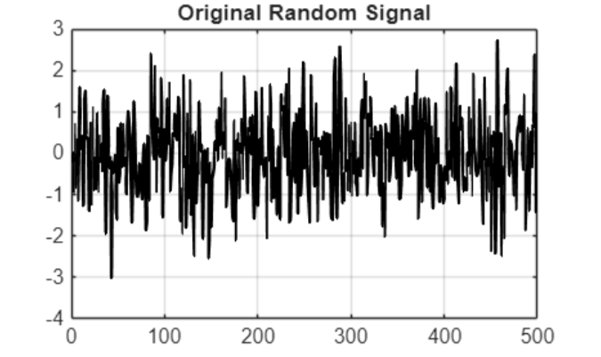
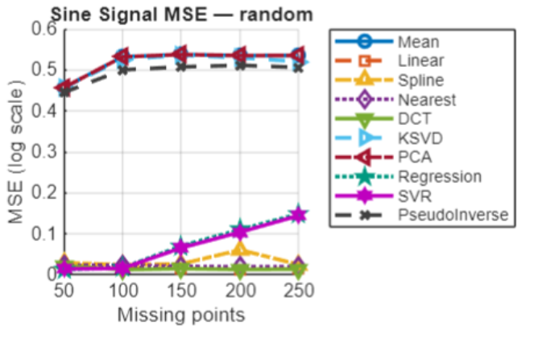

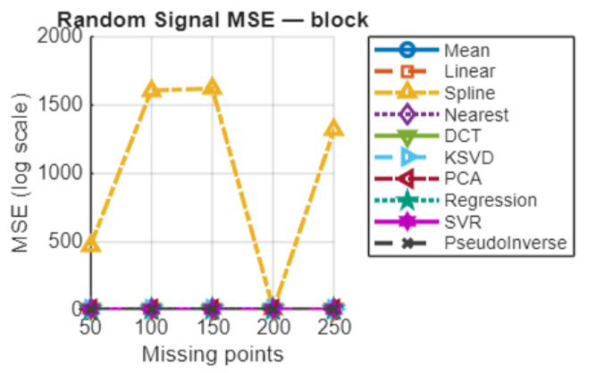

### **Sine Signal**

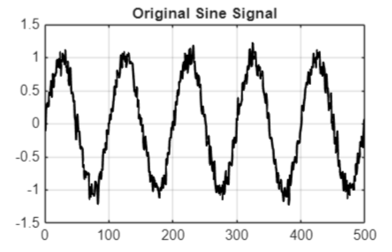

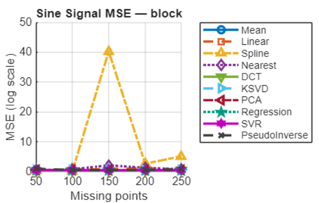

This helped study how different algorithms perform under controlled signal conditions.

---
## Validation using Dataset 
After validating the algorithms on synthetic signals (random and sine), the imputation methods are tested on real environmental data.

- Dataset Source: city_day.csv

- City: Shillong

- Pollutant: Nitrogen Dioxide (NO₂)
### Average Execution Time

- The runtime of each imputation algorithm was measured using MATLAB `tic` and `toc`.  
- The following table shows the average execution time across different missing ratios.

|S.No|Method|Execution Time (seconds)|
|--|----|------|
|1|Mean|0.0006|
|2|Linear|0.0003|
|3|Spline|0.0002|
|4|Nearest|0.0001|
|5|DCT|0.0062|
|6|KSVD|0.0114|
|7|PCA|0.0033|
|8|Regression|0.0182|
|9|SVR|0.0193|
|10|Pseudoinverse|0.0012|

Hardware: CPU  
Platform used: Laptop

### **Random Missing Pattern:** 

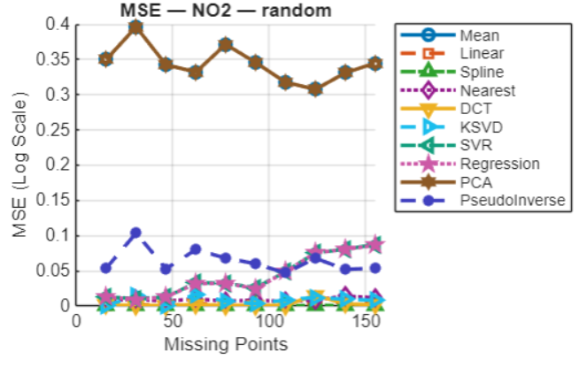
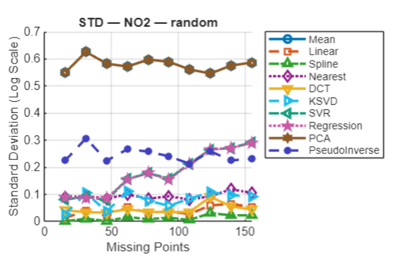

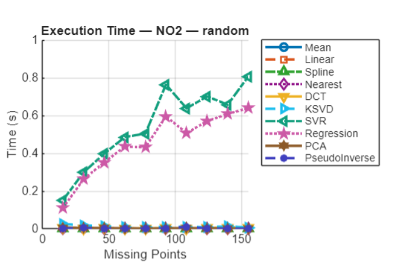

### **Block Missing Pattern**

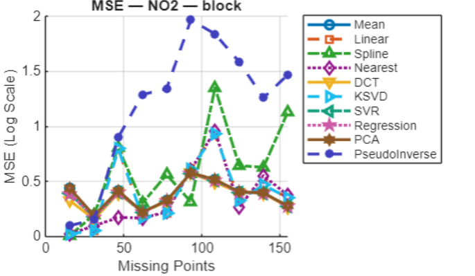
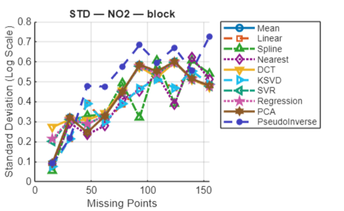

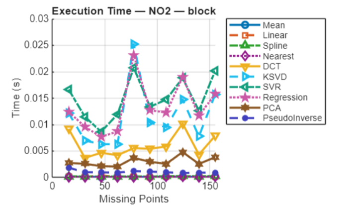

---

## Clustering Analysis of Cities

- Clustering was performed to group cities based on pollution characteristics.

- Statistical features used:

  - Mean pollutant concentration
  
  - Standard deviation

---
## K-Means Clustering

Cities were grouped using **K-Means clustering** based on statistical features of the pollution data.

Let the dataset be

$$
X = \{x_1, x_2, \dots, x_n\}
$$

where each $x_i$ represents the feature vector of a city.

The goal of K-Means is to partition the dataset into $k$ clusters

$$
C_1, C_2, \dots, C_k
$$

by minimizing the **within-cluster variance**.

The objective function is

$$
J =
\sum_{i=1}^{k}
\sum_{x \in C_i}
\|x - \mu_i\|^2
$$

where

- $C_i$ is the $i$-th cluster  
- $\mu_i$ is the centroid of cluster $C_i$

The centroid of each cluster is computed as

$$
\mu_i =
\frac{1}{|C_i|}
\sum_{x \in C_i} x
$$

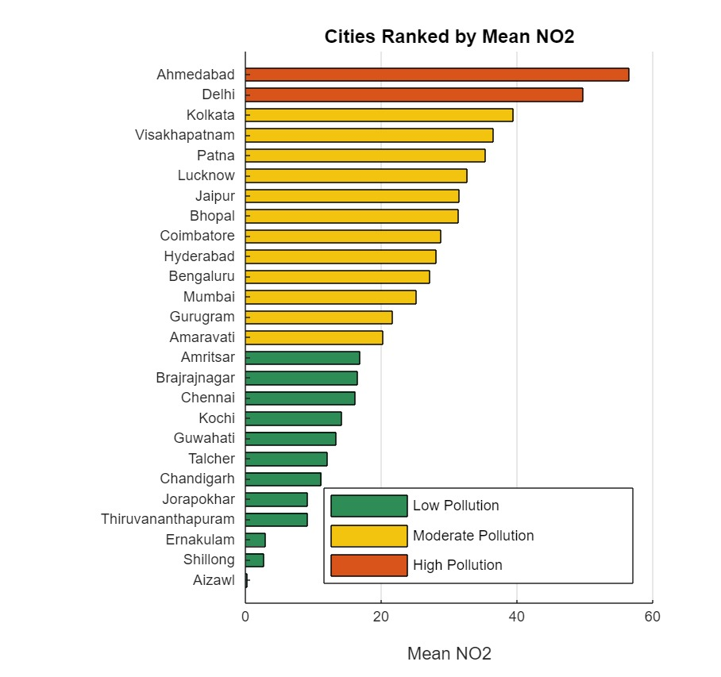

---

### Distance Metric

The distance between two feature vectors is computed using **Squared Euclidean Distance**

$$
d(x,y) =
\sum_{j=1}^{m}
(x_j - y_j)^2
$$

- where $m$ is the number of features.

## Optimal Number of Clusters

The optimal number of clusters $k$ is determined using the **Silhouette Score**.

For each data point $i$:

$$
s(i) =
\frac{b(i) - a(i)}
{\max(a(i), b(i))}
$$

where

- $a(i)$ is the average distance between point $i$ and other points in the same cluster  
- $b(i)$ is the average distance between point $i$ and points in the nearest neighboring cluster  

The silhouette score lies in the range

$$
-1 \le s(i) \le 1
$$

The optimal value of $k$ is selected as the one that **maximizes the average silhouette score** across all data points.

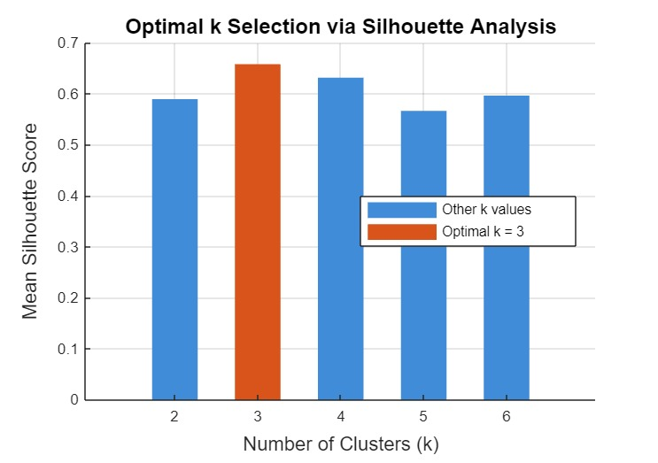

### Pollution Grouping

Using the optimal number of clusters, cities were categorized

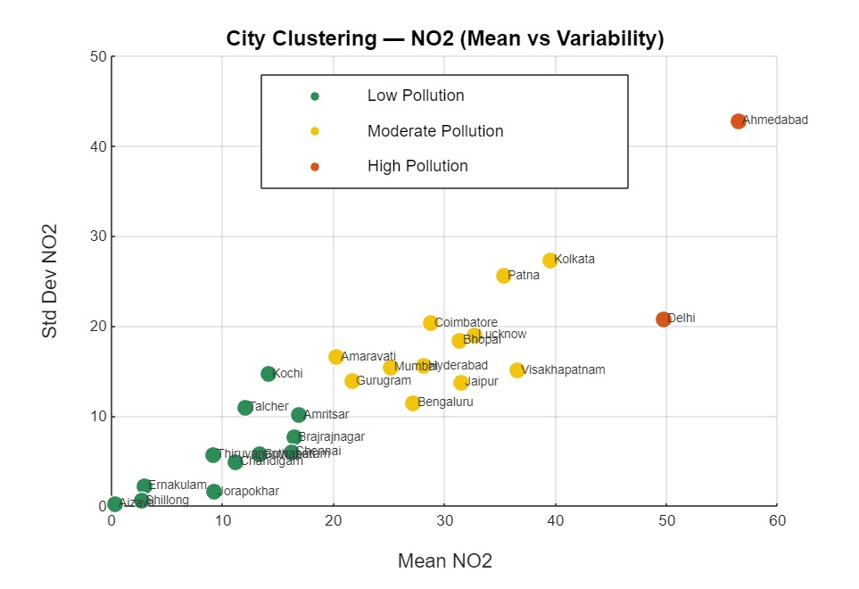

## AirSense Pro – Air Pollution Intelligence Dashboard

AirSense Pro is an interactive data analysis dashboard designed to explore, clean, and analyze air pollution datasets. The platform allows users to upload pollution data and perform various analyses including visualization, missing data handling, clustering, signal reconstruction, and pollution risk identification.

The system processes the city_day.csv & also city_hour.csv dataset and performs all computations directly in the browser.

### 1. Data Upload

  The dashboard begins with uploading the dataset containing city-level pollution measurements recorded over time.
  Once the file is uploaded, the system automatically analyzes the dataset and provides a summary including:

   - Total number of rows
   - Number of cities in the dataset
   - Number of pollutant columns
   - Percentage of missing values
  
   This step prepares the dataset for further analysis.

### 2. Dataset Overview

   The overview module provides a quick understanding of the pollution dataset.
    

   The dashboard displays: 
   
   - Average pollutant levels
   - Peak pollutant values
   - Distribution of pollutant concentrations
   - City-wise pollution comparison

   Users can also select a specific city and visualize how different pollutants change throughout the time period.

### 3. Graph Check Module

The Graph Check module allows users to visually inspect relationships between pollutants.

Users can choose:

* A pollutant column

* Chart type

* A city filter

The dashboard supports three visualization types:

1. Line Graph:
   - Displays pollutant trends over time for selected cities.
   - This helps identify pollution spikes and long-term trends.

2. Bar Chart:
   - Shows average pollutant levels across cities for easy comparison.

3. Scatter Plot:
   - Displays relationships between two pollutants to identify potential correlations.

The module also provides column statistics including:

* Minimum value

* Maximum value

* Mean value

* Standard deviation

* Number of missing values

### 4. Missing Value Analysis

Before performing advanced analysis, the system checks for missing values in the dataset.

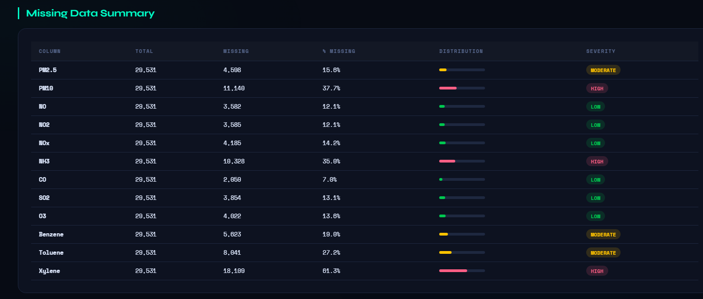

Each pollutant column is analyzed to determine:

* Total number of values

* Number of missing entries

* Percentage of missing data

Based on the missing percentage, columns can be categorized into different severity levels.
This helps decide which imputation method should be used.

### 5. Data Imputation

The dashboard includes several techniques to handle missing pollution measurements.

Supported methods include:

1. Mean Imputation:
   - Missing values are replaced using the average value of the column for the corresponding city.

2. Linear Interpolation:
   - Missing values are estimated by drawing a straight line between the nearest known values.

3. Cubic Spline Interpolation:
   - A smooth curve is fitted between neighboring observations to estimate missing values.

**Hybrid Methods**

Two combined methods are also provided:
1. Linear interpolation followed by mean filling

2. Spline interpolation followed by mean filling

These methods ensure that all missing values are filled while maintaining realistic trends in the data.

After imputation, users can preview the updated dataset and download the cleaned file.

 ### 6. Correlation Heatmap

The **Correlation Heatmap** module measures how strongly pollution levels between different cities are related.

For each selected pollutant, the dashboard calculates the **Pearson correlation coefficient** between every pair of cities.

The correlation value is computed using:

$$
r =
\frac{
\sum_{i=1}^{n} (x_i - \bar{x})(y_i - \bar{y})
}{
\sqrt{\sum_{i=1}^{n} (x_i - \bar{x})^2}
\sqrt{\sum_{i=1}^{n} (y_i - \bar{y})^2}
}
$$

Where:

- $x_i$ and $y_i$ represent pollutant values for two cities  
- $\bar{x}$ and $\bar{y}$ represent the mean values of the pollutant measurements  
- $n$ represents the number of observations

The correlation coefficient ranges between:

- **+1 → Strong positive correlation**
- **0 → No correlation**
- **−1 → Strong negative correlation**

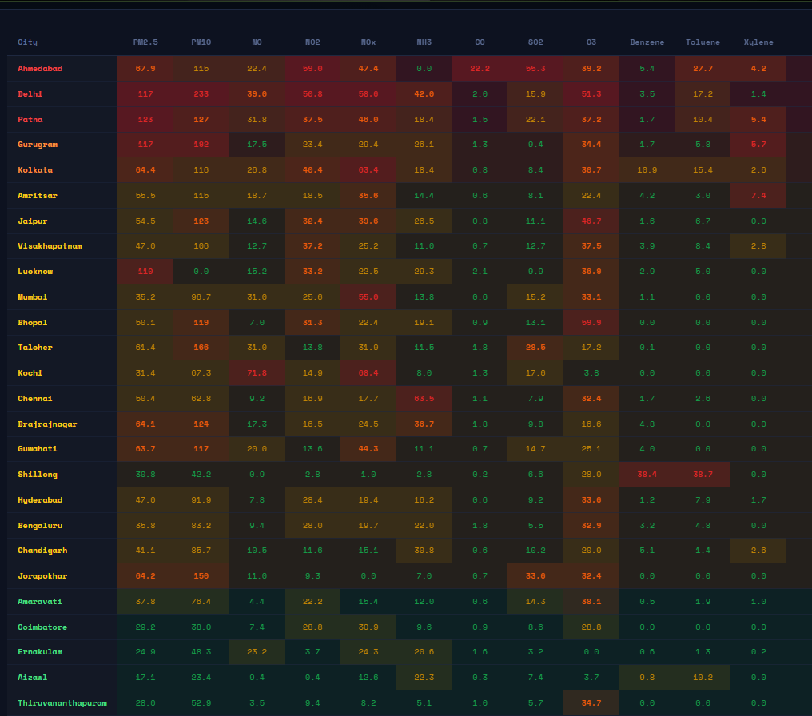

This visualization helps identify cities that experience similar pollution patterns.

### 7. Cluster Analysis

Cluster Analysis groups pollution data into clusters using the K-Means algorithm.

Each data point represents a city-day observation with selected pollutant values.

Cities with similar pollution characteristics are grouped together into clusters.

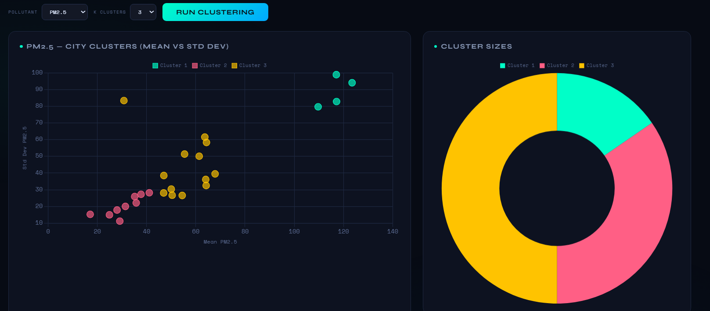

The clustering module provides:

* Scatter plot of pollution clusters

* Cluster size distribution

* Cluster centroids (average pollution values)

* Cluster pollution profiles

This helps identify pollution patterns such as:

* Low pollution conditions

* Moderate pollution days

* Severe pollution

### 8. Signal Reconstruction

This module demonstrates how missing pollution data can be reconstructed using signal processing techniques.

The process works as follows:

<ol type="i">
  <li>A portion of the pollutant time-series is intentionally removed to simulate missing data.</li>
  <li>The corrupted signal is filled with temporary values.</li>
  <li> The signal is transformed into the frequency domain using the Discrete Cosine Transform (DCT).</li>
  <li>Only the most important frequency components are retained.</li>
  <li>The signal is reconstructed using the Inverse DCT.</li>
</ol>

The system then evaluates reconstruction quality using metrics such as:

* Mean Squared Error

* Error Standard Deviation

The results are displayed through:

* Original vs corrupted signal comparison

* Reconstructed signal plot

* Error visualization

### 9. Pollution Alert System

The Pollution Alert module ranks cities based on pollution severity.

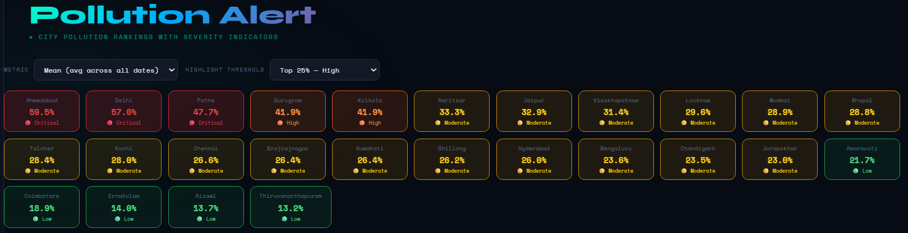

Cities are analyzed using pollutant averages or peak values.

The dashboard generates:

* Pollution ranking charts

* Radar charts showing pollutant profiles

* City vs pollutant heatmaps

Cities exceeding high pollution thresholds are highlighted to indicate potential environmental risk zones.

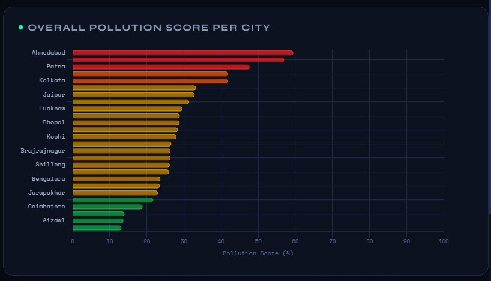

## Conclusion

This project studied the problem of missing values in air pollution time-series data using multiple reconstruction techniques and evaluation strategies. Experiments were conducted on both synthetic signals and real-world pollution datasets to analyze reconstruction behavior under different missing data conditions. An interactive dashboard was also developed to support visualization, correlation analysis, clustering, and signal reconstruction for better understanding of pollution patterns across cities.
